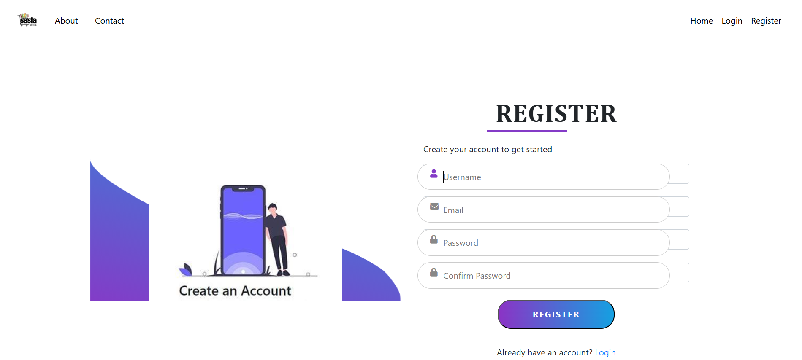
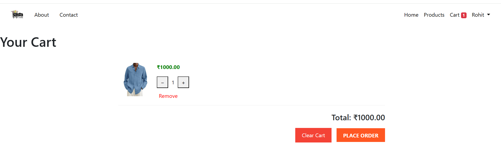

# Django-Ecommerce

This project is a Django-based eCommerce web application that supports product listings, user accounts, shopping cart functionality, and order management. It includes an admin panel for managing products and users, along with responsive UI templates.

To run this project: Install necessary requirements, Then run commands as follows: i. python manage.py makemigrations ii. python manage.py migrate iii. python manage.py runserver

# Screenshots for reference:-

1. Home Screen:-   
2. Login Page:-    
3. Register Page:- 
4. Products Page:- 
5. Cart Page:-     
